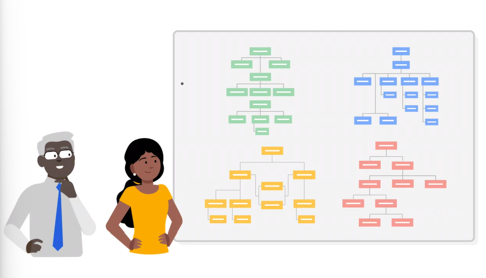
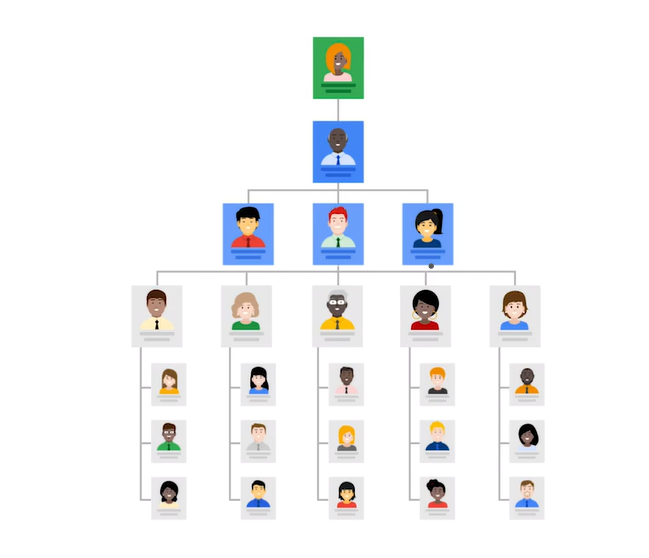
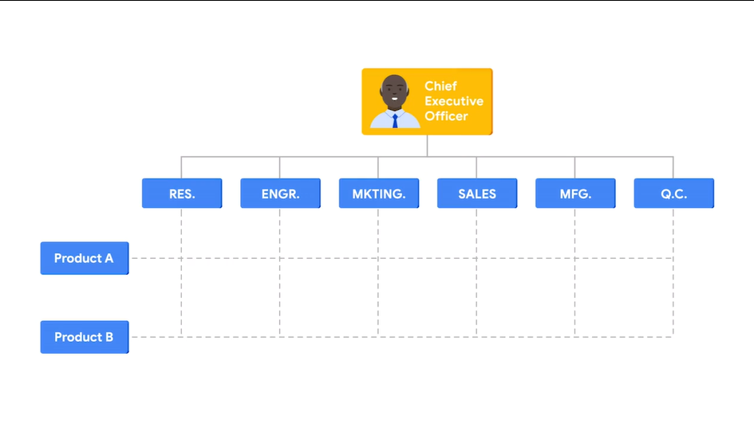
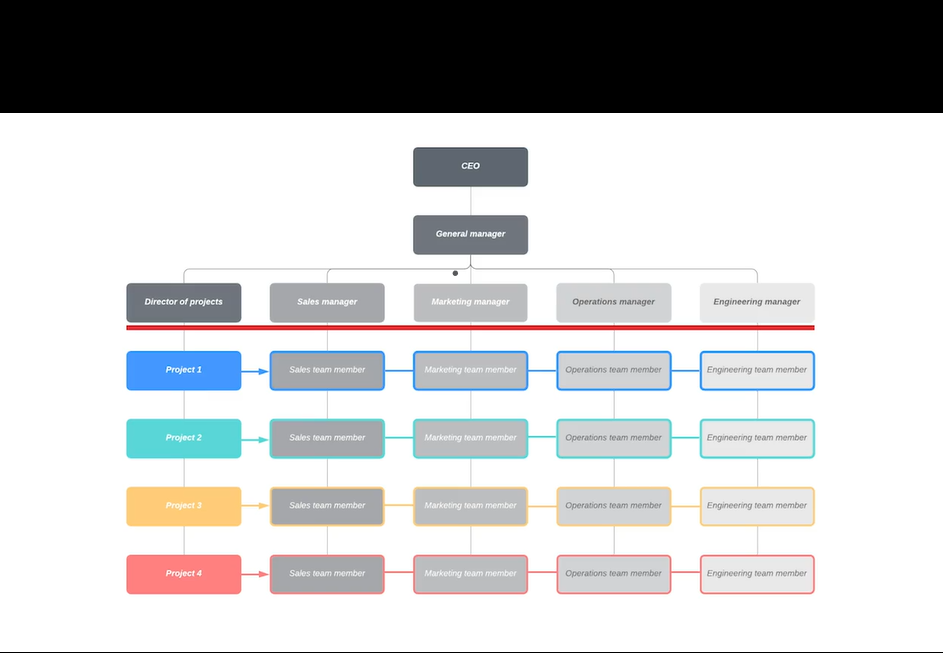

# Organizational Structure and Culture

- Organizational Structure referes to the way a company/organization is arranged.
- This just give you a sense of who report to who.

# Organizational heirachy

- An organizational structure is mostly mapped out using a _reporting chart_ or an _orgchart_
- _Reporting charts_ - shows the relationshi between poeple in groups.
  

# Groupings

## Classic Organizational Heirachy

- Traditional top-down system of reporting
- Functional pr top-down structures
- follows a typical chain of command.
  

## Matrix structure

- Direct higer-ups and stakeholders from other departments or programs.
  
  

- During an interview you can ask for the type of organizational structure the company uses and whre your role will fit in.

- knowing this structure tells you who to report to , who your team members are ,and who they report to.

## How they impact projects.

- Authority - _ability to make decisions for the project that impact the organization_.
  - Some times you can select vendors and other times you can have vendors selected for you
  - Levels of responsibility and authority vary from project to project.
- Resource Availability - _knowing how to access the people,equipment, and budget needed for a project_

  - In an Classical heirachy its likely that your budget an resouces are decided by the department heads or function heads or anyone above you so its important to know that who you depend on.
  - If you need a budget increase you elevate your demand to the department head and then he/she elevates to his boss.
  - In the matrix you might have to negotiate with other PMs
  - Establish your stakeholders.

- A Project management Office (P.M.O) is a team if project managers.we are a grou that coordinates all of the different projects together incliding folks who work on our product,engineers and many business funstions and we help bring all of those ideas to life.

# Organization Culture

- Part of culture include believes ,traditions, and customs.
- this can give you insight and a more complete picture into who they are how they navigate the world and the same can be true for organizations.
- It acts as a guide for what the people in the organization value,how they operate in a daily,how they relate to one another and how theya are expected to perform.
- Some enphasize teamwork and attention to detail.
- _Organizational Culture refers to the values employees share,as well as the organization's values,mission and history_
- Its pretty much the companies personality.
- This helps avoid conflict and ensure completion in harmony.
- Mission and vision can give a great insigt into company culture.
- If you can Demostrate how a project can support the company values you will have more support fron the stakeholders to resources and approvals you need.
- Pay attend to what the leaders values. Is it speed,detail e.t.c

### What to consider when evaluating company culture?

- How does communication happen?
- How are decisions made? Is is majority or top down approach.
- What kind of rituals are in place when someone new comes to the facility?
- How are project typically run?
- What kind of practices, behaviors and values are reflected by the people in the organization

## Navigating Company Culture

- Ask Questions.
  - Whats going well and whasts not
- Make observations
  - look at what people like
- Understand your impact
  - Beware of your role as a change agent
    - _A person from the insife an organizaation who hels the organization transfrom by focusing on improving organizational effectiveness and development_

# Change Management

- _The process of delivering your complete project and getting people to adopt it_.

## Core concepts under change management

- Create a sense of ownership and agency.
- Figure out the right combination of skills and personalities
  - Communicate clearly your vision.
- Effective Communication.
  - being transparent, and sharing relevant information.

