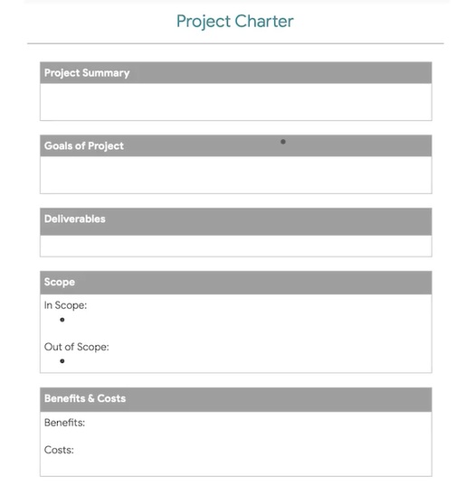

# Project Initiation

- Is the first phase of the project life cycle followed by planning ,executing and closing
- A well planned initiation is a good foundation for your project.
- Initition is done to solve a specific problem for the business.
- Identifying the project goals is one of your vital roles.Compiling other details like resources based on initial disscussions with the stakeholder.This will help solidify the scope and boundary.
- Proper initiation also ensures that the project benefits outway the costs (Cost Benefit Analysis).
- _<b>Cost Benefit Analysis</b> -the process of adding up the expected value of--the benefits--and comparing them to the dollar costs._

### Qns to determine Project Benefits.

- What value will this project create?
- How much money could this project save our organization?
- How much money will it bring in from existing customers?
- How much time will be saved?
- How will the user experience be improved?

### Qns to determine Project Costs.

- How much time will people spend on this project?
- What will be the One time costs
- Are there Ongoing costs
- Are there any Long term costs.

### Key Components of Project Initation For project Success

- Goals
  - Is what youve been asked todo and what you're tring to acheive.Often determined by senior stakeholders with your help
- Scope
  - Is the process to define the work that needs to happen to complete the project.
- Deliverables
  - Products and services that you will create for your customer, client or project sponsor.
- Success Criteria
  - Standards by wich you measure how succesful a project was in reacing its goals.
- Stake Holders
  - People who both have an interest in, and are affected by,the completion and succes of a project.Often take part in determining the previous keys
- Resources

  - Budget,people and materials you have at your disposal.

- _After determining these you will create a <b>project charter</b>_

- __Project Charter__
    - A document that clearly defines the project and its goals, and outlines what is needed to accomplish them.

- it allows you to creaate a framework on how to approach the project.It should the be presented to the stakeholders.
