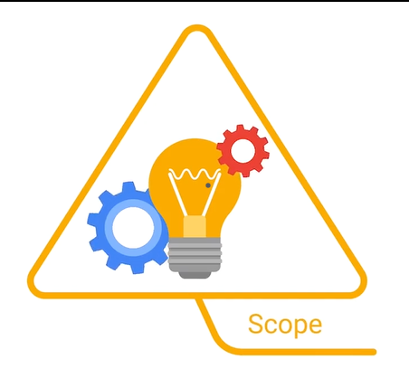
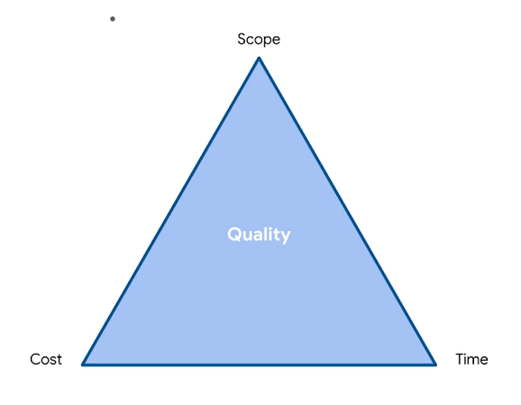

# Defining and Determing Project Scope

- Project Scope is just the boundaroes of a project.
  
- It defines what a team has agreed to include and exclude from the project.it helps to clearly define and map out the project.
- Include Timeline, budget and resources.

- **In-scope**
  - Tasks that are included in the project plan and contribute to the project's overall goals.
- **Out-of-scope**
  - Tasks that are not included in the project plan and do not contribute to the project's overall goals.
- **Scope Creep**

  - Changes, growth, and uncontrolled factors that affect a project's scope at any point after the project begins.
  - external and internal.

  Solutions

  - plans should be visible.
  - Get clarity on projrct requirements
  - Set Ground rules and expectations for stake hoder involvemnt.

- Come up with a plan to deal wit out of scope requests.
- put agreements in writing.

## Managing changes to project Scope

- Defining project Scope goes hand in hand with defining the goals.
- While the project has its own goals your duty as a PM is to deliver the project according to the scope agreements.
- Any time you take on an unplanned task more is loast than just the time spent
- Use the _tripple contrain model_ to determine whether a scope change is acceptable.
  

- **Time** - Project Schedule and Deadlines.
- **Cost** - Include budget ,resources and people working on the project.
- You cant change one without affecting the others._for instance an increase in cost means a change in time or scope_.
- Understanding how they affect each other.
- Undesrtand whats most important.

## Launching and Landing a Project.
- Launching is delivering the final result of your project to client or user.
- Landing is mesasuring the success of your project using the success criteria established at the outset of the project.

## Definning Success Criteria
- Tells you whether or not the project was successfully.
- SPecific details of pporjects , deliverables , requirements and exprectations.
- The standards by which the project will be judged once its been delivered to stakeholders.
16