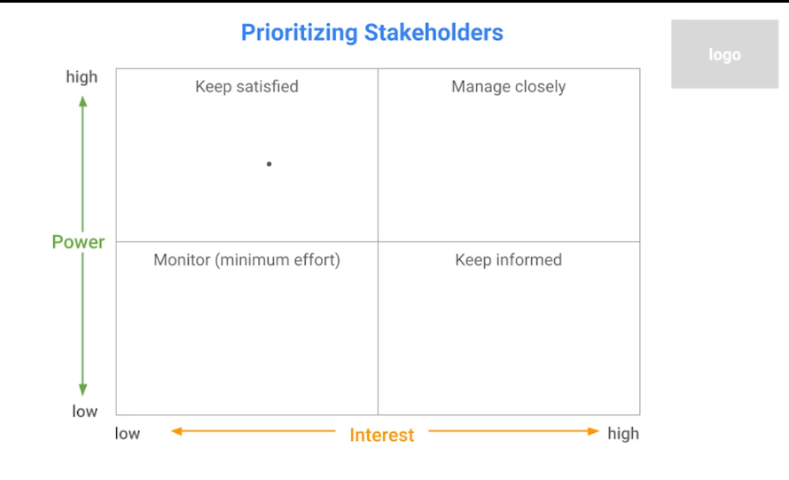
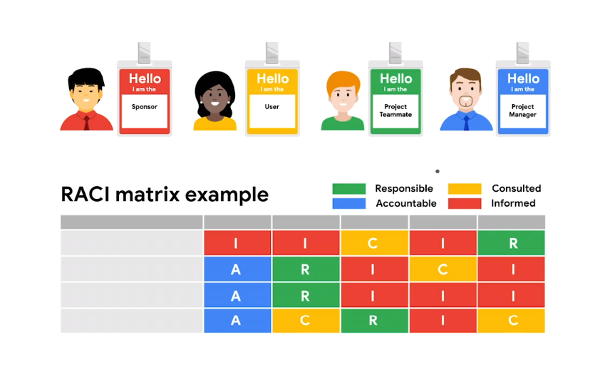

## Working Effectivily with Stakeholder

- **Stakeholders** - people who are interested in and affected by the project's completion and success.

> **Accssibility** - activily removing any barriers that might prevent persons with disabilities from being able to access technology, information, or experiences,and leveling the playing field so everyone has an equal chance of enjoying life and being successful.

# Project Teams

- This is a very _critical_ stage of project initiation that heavily depends on the previous discussed needs and requirements of the project.

## When Choosing a team, consider:

- Required roles.
  - In the same way the PM is accountable for the overall initiation,planning, execution and completion of a project. The person in each role is accountable for specific tasks within the project lifecycle. _for instance a home construction project might require an architect_
- Team Size.
- Necessary Skills.
  - Ensure everyone on the team has the right skills._Keep in mine that skills can be learn't_
- Availabity for project.
- Motivation

  - If given the chance to ,Pick people that are excited to get involved.

- Clearly outlining responsibilities for each role but keep in mind that sometimes team members have to adapt to many different roles depending on the size of the company

- Regardless of the company size, the following roles must be included;

  - **Project Sponser**
    - The person who's accountable for the project and who ensures the project delivers the agreed upon business benefits._Probably fund the project and communicate dirrectly with managers and key stakeholders_.
  - **Team Member**
    - The people doing the work and making the project happen.
  - **User**
    - The people getting some sort of value from a succcessfully landed project.
  - **StakeHolder**
    - Anyone involved in the project who has a vested interest in the project's success.
  - **Project Manager**
    - Manages schedules,tasks and resources on the project.

- Recall our Office green Project, Office green is a commercial plant company that does interior landscaping and plant design for offices and other commercial businesses.We rolling out our new plant service and if you recall out _S.M.A.R.T goal_ role out a new plant service to provide office plant to top clients by the end of the year.
  - Project Sponser = Director of Product
  - Team Members = Marketing Team
  - Team Members = Web designers, landscape designer
  - Project Manager = **YOU**
  - Customers = Buyers like a procurement company.
  - Users = Employees at the offices of the procurement company.
  - Stakeholders = all the above mentioned people are stakeholders

> Pm concepts are just a tool, you need to study the team members personalities so that you can tailor your approach to make sure that you're working effectively.

## Completing Stakeholder Anaylsis

- Primary stakeholders are people who will benefit directly from the project's success, while secondary stakeholders are indirectly impacted by the project's success.
- When done well stakeholder anaylsis, helps you see all opportunities for success and potential risks.It illucstrates which stakeholders take on with responsibilities and can help you the right people in important conversation which will ensure that you get the right support.
- The Stake Holder Anaylsis involves 3 key steps;

1. Make a list of all the staholders the project impacts.
2. Determine the level of interest and influence for each stakeholder.
3. Assess stakeholders' ability to participate and then find ways to involve them.
   

- Stakeholder buyin

## RACI Chart

- A RACI chart helps to define roldes and responsibilities for the individuals or teams to ensure work gets done efficiently.It creates clear Rules on how everyones involved.
  <b style="font-size:20px; padding-right:2px">R</b><i>esponsible</i> 
  <b style="font-size:20px; padding-right:2px">A</b><i>ccountable</i> 
  <b style="font-size:20px; padding-right:2px">C</b><i>onsulted</i> 
  <b style="font-size:20px; padding-right:2px">I</b><i>nformed</i> 

1. Reponsible

- Those doing the work to complete the task.

2. Accountable

- Those making sure the work gets done.

3. Consulted

- Those giving feedback, like subject matter experts or decision makers.

4. Informed

- Those just needing to know the final decisiions or that a task is complete.

